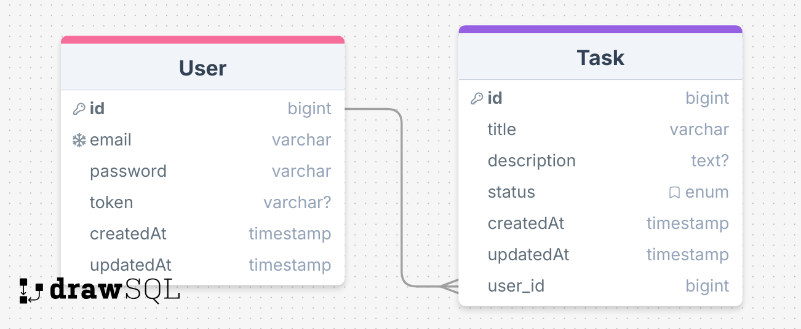

# API de Gerenciamento de Tarefas

## Sobre o Projeto

Esta é uma API RESTful para gerenciamento de tarefas (Tasks) construída com Node.js, AdonisJS e MySQL. A aplicação segue o padrão de arquitetura MVC e oferece operações completas de CRUD para tarefas, além de autenticação de usuários.

## Tecnologias Utilizadas

- Node.js (v18+)
- AdonisJS
- MySQL
- Docker & Docker Compose
- Autenticação JWT

## Recursos

- Gerenciamento completo de tarefas (criar, ler, atualizar, excluir)
- Autenticação de usuários com JWT
- Validação de dados
- Migrations e Seeders para o banco de dados
- Containerização com Docker

## Pré-requisitos

- Docker e Docker Compose
- Git

## Instalação e Configuração

1. Clone este repositório:
```bash
git clone <url-do-repositório>
cd sesatech-task-api
```

2. Execute os containers Docker:
```bash
docker-compose up -d 
```

3. Execute as migrações para criar as tabelas no banco de dados:
```bash
docker exec -it task-api node ace migration:run
```

4. Popule o banco de dados com dados iniciais:
```bash
docker exec -it task-api node ace db:seed
```

5. Para visualizar todos os endpoints registrados na aplicação:
```bash
docker exec -it task-api node ace list:routes
```

## Documentação da API

### Endpoints de Autenticação

| Método | Endpoint | Descrição |
|--------|----------|-----------|
| POST | `/api/v1/auth/login` | Login do usuário (retorna token JWT) |
| GET | `/api/v1/auth/user/tokenIsActive` | Verifica se o token é válido |
| POST | `/api/v1/auth/logout` | Logout (invalida o token) |

### Endpoints de Usuários

| Método | Endpoint | Descrição |
|--------|----------|-----------|
| GET | `/api/v1/users` | Lista todos os usuários |
| GET | `/api/v1/users/:id` | Busca usuário por ID |
| POST | `/api/v1/users` | Cria novo usuário |
| PUT | `/api/v1/users/:id` | Atualiza usuário |
| DELETE | `/api/v1/users/:id` | Exclui usuário |

### Endpoints de Tarefas

| Método | Endpoint | Descrição |
|--------|----------|-----------|
| GET | `/api/v1/tasks/all` | Lista todas as tarefas (público) |
| GET | `/api/v1/tasks` | Lista tarefas do usuário autenticado |
| GET | `/api/v1/tasks/:id` | Busca tarefa por ID |
| POST | `/api/v1/tasks` | Cria nova tarefa |
| PUT | `/api/v1/tasks/:id` | Atualiza tarefa |
| DELETE | `/api/v1/tasks/:id` | Exclui tarefa |


## Fluxo de Autenticação

1. Crie um usuário usando o endpoint `/api/v1/users`
2. Gere um token JWT fazendo login no endpoint `/api/v1/auth/login`
3. Use o token retornado no cabeçalho Authorization para os endpoints protegidos de tarefas

## Testes

Você pode encontrar uma coleção do Postman com todas as requisições da API na pasta `docs`.

## Estrutura do Banco de Dados

### Usuários
- `id`: Chave primária
- `email`: Email do usuário (único)
- `password`: Senha criptografada
- `created_at`: Timestamp de criação
- `updated_at`: Timestamp de atualização

### Tarefas
- `id`: Chave primária
- `title`: Título da tarefa
- `description`: Descrição da tarefa
- `status`: Status da tarefa (pending/completed)
- `user_id`: Chave estrangeira para a tabela de usuários
- `created_at`: Timestamp de criação
- `updated_at`: Timestamp de atualização





## Estrutura do Projeto

O projeto segue a estrutura do AdonisJS com:

- `app/controllers`: Manipuladores de requisições HTTP
- `app/models`: Modelos de banco de dados
- `app/services`: Lógica de negócios
- `app/repositories`: Camada de acesso a dados
- `app/validators`: Validação de requisições
- `database/migrations`: Migrações do banco de dados
- `database/seeders`: Seeders do banco de dados

## Diferenciais Implementados

- Docker & Docker Compose para fácil configuração
- Autenticação e autorização com JWT
- Validação de dados com VineJS
- Migrations e Seeders para o banco de dados
- Arquitetura em camadas (Controllers, Services, Repositories)
- Tratamento de exceções personalizado